# ADUANKU - Community Issue Management System
A community issue management system for reporting and tracking local issues with separate user and admin interfaces.

## 🚀 Quick Start (Development)

### Prerequisites
- Docker and Docker Compose installed
- Git
- Node Js

### Setup and Run

```bash
# Clone the repository
git clone <your-repo-url>
cd my-aduanku

# Start development environment
./start-dev.sh

# Create default users (superadmin, admin, user)
./seed-users.sh

# Stop all services
./stop.sh
```

## 📱 Access the Application

- **Frontend**: http://localhost:3000
- **Auth Service**: http://localhost:5001
- **User Service**: http://localhost:5002
- **Issue Service**: http://localhost:5003
- **Comments Service**: http://localhost:5004
- **Analytics Service**: http://localhost:5005

## 🏗️ Tech Stack

### Frontend
- React 19 (TypeScript)
- React Router DOM
- Tailwind CSS
- Heroicons

### Backend
- Node.js microservices architecture
- Express.js
- MongoDB with replica set
- JWT authentication

### Services
- **auth-service** (Port 5001): User authentication
- **user-service** (Port 5002): User management
- **issue-service** (Port 5003): Issue tracking
- **comments-service** (Port 5004): Comments and discussions
- **analytics-service** (Port 5005): Analytics and reporting

## 🌱 Seeding Default Users

The seed script creates three default users with different roles for testing and development:

```bash
./seed-users.sh
```

This will create:
- **Superadmin**: Full access including user deletion
- **Admin**: Can manage users and issues
- **User**: Can report and view issues

**Note:** Run this script **after** starting the development environment with `./start-dev.sh`. The script is safe to run multiple times - it will skip users that already exist.

## 🔑 Default Login Credentials

After running `./seed-users.sh`, you can login with these accounts:

**Superadmin:**
- Email: `superadmin@aduanku.com`
- Password: `superadmin123`

**Admin:**
- Email: `admin@aduanku.com`
- Password: `admin123`

**User:**
- Email: `user@aduanku.com`
- Password: `user123`

## 📁 Project Structure

```
my-aduanku/
├── frontend/           # React frontend application
├── backend/
│   ├── auth-service/       # Authentication service
│   ├── user-service/       # User management service
│   ├── issue-service/      # Issue tracking service
│   ├── comments-service/   # Comments service
│   └── analytics-service/  # Analytics service
├── docker-compose.dev.yml  # Development Docker Compose
├── start-dev.sh           # Development startup script
├── seed-users.sh          # Create default users script
└── stop.sh                # Stop all services script
```

## 📝 Features

- User authentication with three roles (Superadmin/Admin/User)
- Role-based access control
- Issue reporting with geolocation
- Auto-assignment workflow to admins
- Comments and discussions on issues
- Status tracking (Reported → In Review → Assigned → Resolved)
- Admin dashboard with analytics
- User dashboard
- Profile management
- User management (edit/delete)

## 📸 Screenshots

### Login Interface

<table>
  <tr>
    <td width="33%">
      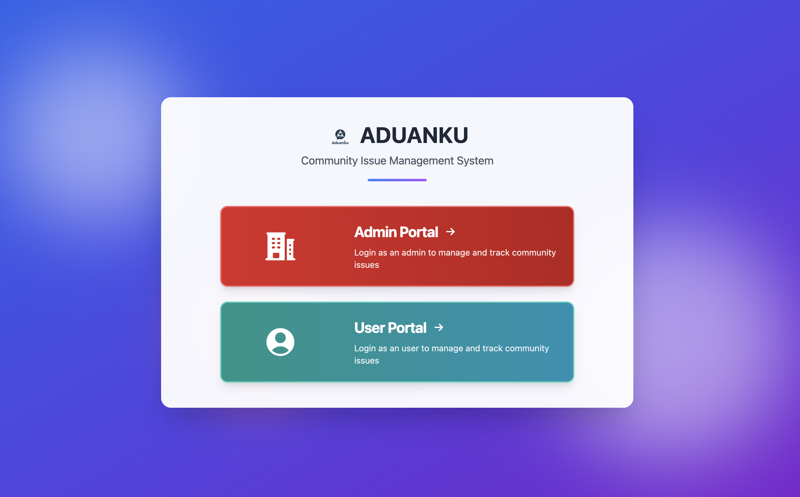
      <p align="center"><strong>Login Selection</strong></p>
    </td>
    <td width="33%">
      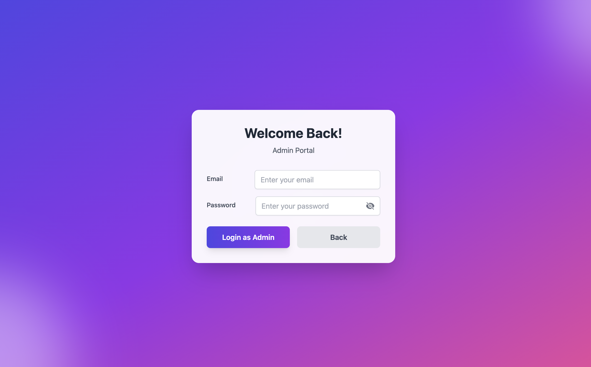
      <p align="center"><strong>Admin Login Portal</strong></p>
    </td>
    <td width="33%">
      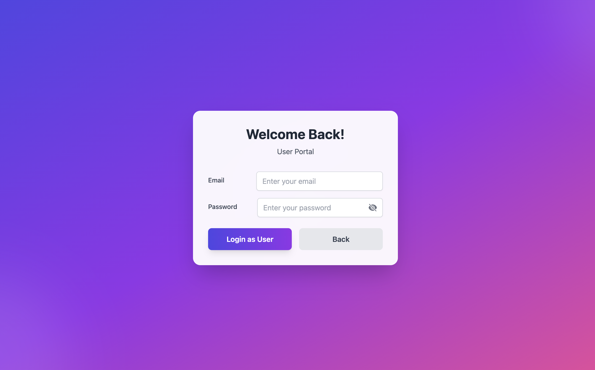
      <p align="center"><strong>User Login Portal</strong></p>
    </td>
  </tr>
</table>

### Admin Dashboard

<table>
  <tr>
    <td width="50%">
      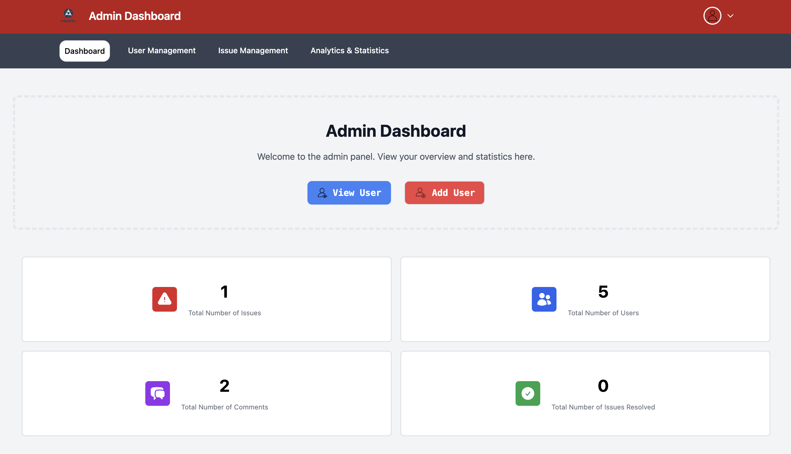
      <p align="center"><strong>Admin Dashboard</strong></p>
    </td>
    <td width="50%">
      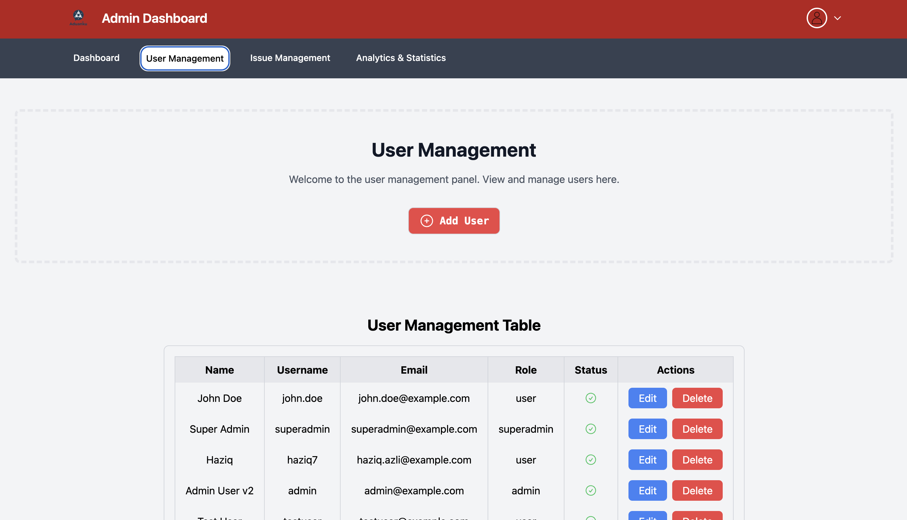
      <p align="center"><strong>User Management</strong></p>
    </td>
  </tr>
  <tr>
    <td width="50%">
      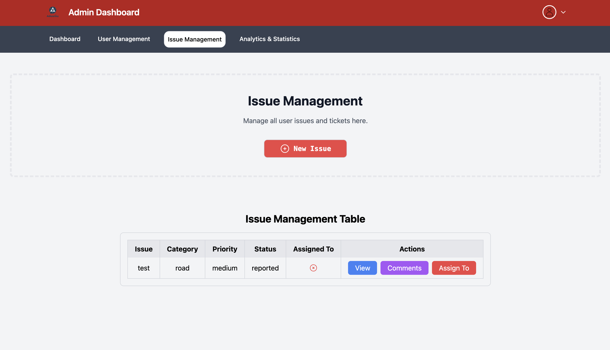
      <p align="center"><strong>Issue Management</strong></p>
    </td>
    <td width="50%">
      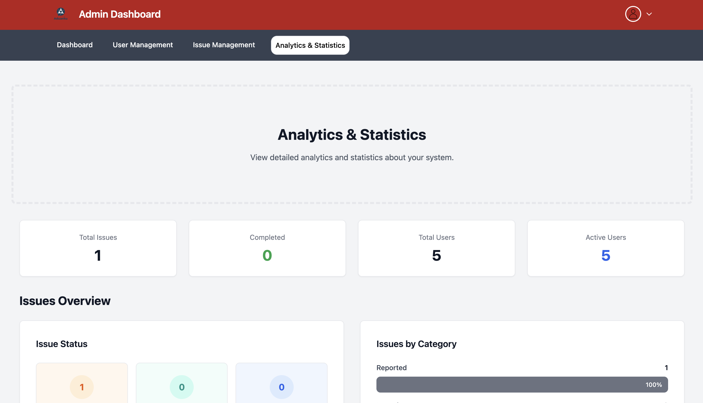
      <p align="center"><strong>Analytics - Overview</strong></p>
    </td>
  </tr>
  <tr>
    <td width="50%">
      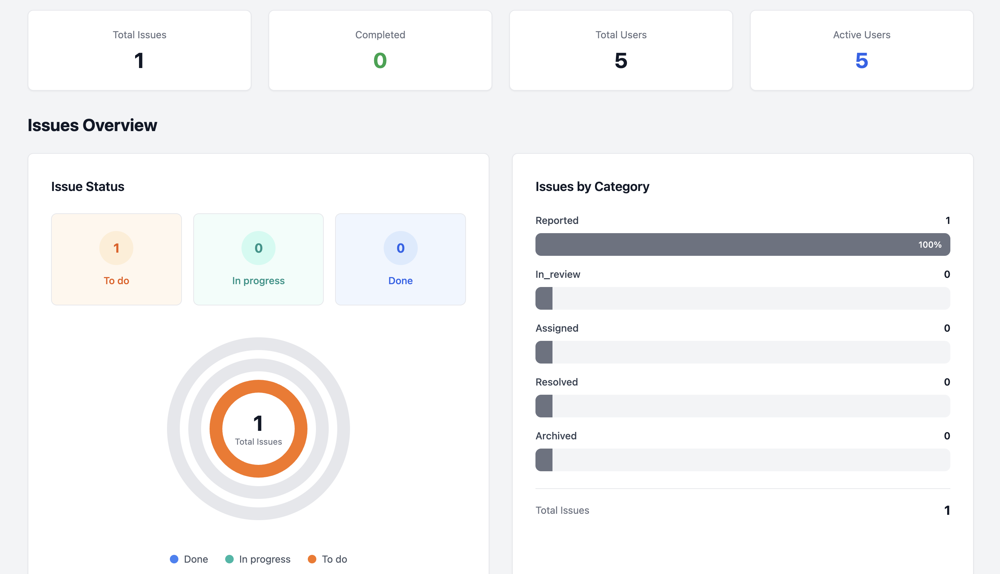
      <p align="center"><strong>Analytics - Charts</strong></p>
    </td>
    <td width="50%">
      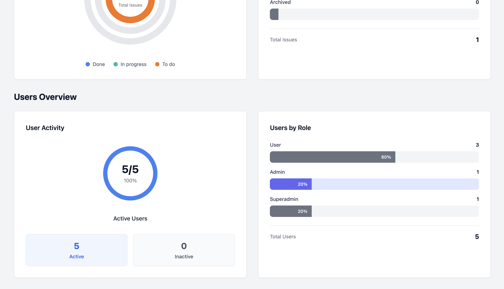
      <p align="center"><strong>Analytics - Details</strong></p>
    </td>
  </tr>
</table>

### User Dashboard

<table>
  <tr>
    <td width="50%">
      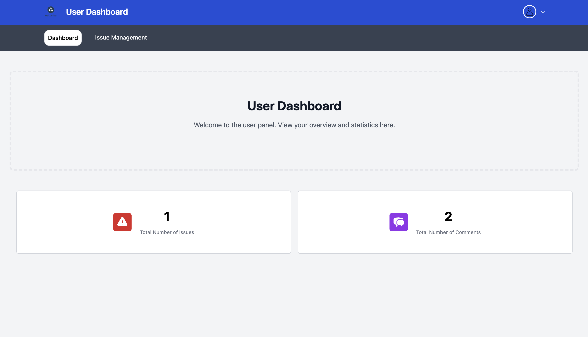
      <p align="center"><strong>User Dashboard</strong></p>
    </td>
    <td width="50%">
      
      <p align="center"><strong>Issue Management</strong></p>
    </td>
  </tr>
  <tr>
    <td colspan="2">
      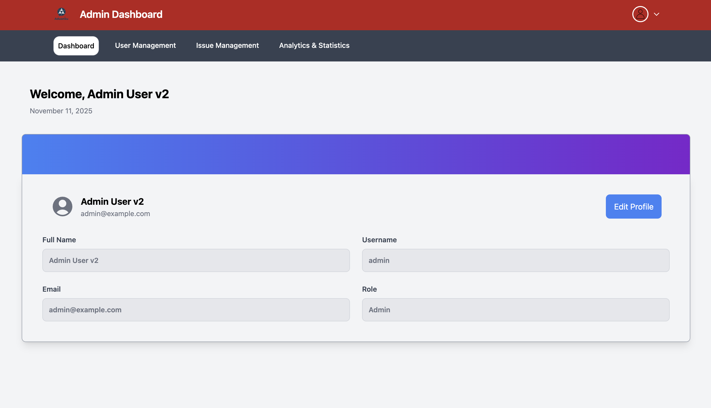
      <p align="center"><strong>Profile Settings</strong></p>
    </td>
  </tr>
</table>

